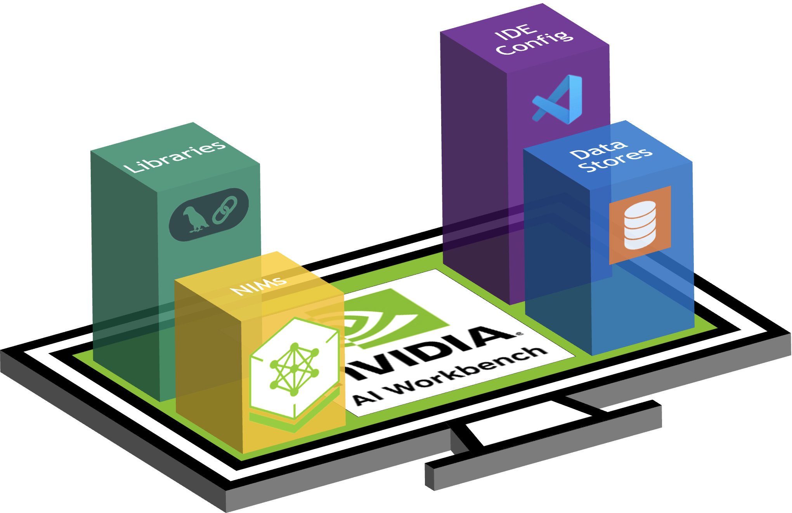
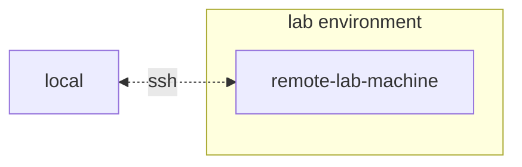

# NVIDIA Sales Kit Template

Use this project as a starting point for building new sales kits with
NVIDIA AI Workbench.

| ❗ Important                                                                                                                                                                                                 |
| :---------------------------------------------------------------------------------------------------------------------------------------------------------------------------------------------------------- |
| When editing markdown sections, run `make` from this directory to populate changes to `README.md`. If adding or removing markdown files, ensure those changes are reflected properly in the `_TOC.md` file. |

Get started now with the [quick start](#quick-start) instructions.



<!-- Links -->

<p align="center"> 
  <a href="https://www.nvidia.com/en-us/deep-learning-ai/solutions/data-science/workbench/" style="color: #76B900;">⬇ Download NVIDIA AI Workbench</a> •
  <a href="https://docs.nvidia.com/ai-workbench/" style="color: #76B900;">📖 Read the Docs</a> •
  <a href="https://forums.developer.nvidia.com/c/ai-data-science/nvidia-ai-workbench/671" style="color: #76B900;">🚨 Problem? Submit a ticket here!</a>
</p>
 
  - [<span class="toc-section-number">1</span> Quick
    Start](#quick-start)
      - [<span class="toc-section-number">1.1</span> Generate your NGC
        Personal Key](#generate-your-ngc-personal-key)
      - [<span class="toc-section-number">1.2</span> Install AI
        Workbench](#install-ai-workbench)
      - [<span class="toc-section-number">1.3</span> Download this
        project](#download-this-project)
      - [<span class="toc-section-number">1.4</span> Start This
        Project](#start-this-project)
  - [<span class="toc-section-number">2</span> Developing Your Own
    Applications](#developing-your-own-applications)
  - [<span class="toc-section-number">3</span> Application
    Configuration](#application-configuration)
  - [<span class="toc-section-number">4</span>
    Contributing](#contributing)
      - [<span class="toc-section-number">4.1</span> Updating
        documentation](#updating-documentation)
  - [<span class="toc-section-number">5</span> Managing your Development
    Environment](#managing-your-development-environment)
      - [<span class="toc-section-number">5.1</span> Environment
        Variables](#environment-variables)
      - [<span class="toc-section-number">5.2</span> Python Environment
        Packages](#python-environment-packages)
      - [<span class="toc-section-number">5.3</span> Operating System
        Configuration](#operating-system-configuration)

# Quick Start

## Generate your NGC Personal Key

| ❗ TODO                                                                                                                 |
| :--------------------------------------------------------------------------------------------------------------------- |
| Use this section to explain any prerequisites required for running this sales kit. An example has been provided below. |

To allow AI Workbench to access NVIDIA’s cloud resources, you’ll need to
provide it with a Personal Key. These keys begin with `nvapi-`.

<details>
<summary>
<b>Expand this section for instructions for creating this key.</b>
</summary>

1.  Go to the [NGC Personal Key
    Manager](https://org.ngc.nvidia.com/setup/personal-keys). If you are
    prompted to, then register for a new account and sign in.
    
    > **HINT** You can find this tool by logging into
    > [ngc.nvidia.com](ngc.nvidia.com), expanding your profile menu on
    > the top right, selecting *Setup*, and then selecting *Generate
    > Personal Key*.

2.  Select *Generate Personal Key*.
    
    

3.  Enter any value as the Key name, an expiration of 12 months is fine,
    and select all four services. Press *Generate Personal Key* when you
    are finished.
    
    

4.  Save your personal key for later. Workbench will need it and there
    is no way to retrieve it later. If the key is lost, a new one must
    be created. Protect this key as if it were a password.
    
    

</details>

## Install AI Workbench

This project is designed to be used with [NVIDIA AI
Workbench](https://www.nvidia.com/en-us/deep-learning-ai/solutions/data-science/workbench/).
While this is not a requirement, running this demo without AI Workbench
will require manual work as the pre-configured automation and
integrations may not be available.

This quick start guide will assume a remote lab machine is being used
for development and the local machine is a thin-client for remotely
accessing the development machine. This allows for compute resources to
stay centrally located and for developers to be more portable. Note, the
remote lab machine must run Ubuntu, but the local client can run
Windows, MacOS, or Ubuntu. To install this project local only, simply
skip the remote install.



### Client Machine Install

Ubuntu is required if the local client will also be used for developent.
When using a remote lab machine, this can be Windows, MacOS, or Ubuntu.

<details>
<summary>
<b>Expand this section for a Windows install.</b>
</summary>

For full instructions, see the [NVIDIA AI Workbench User
Guide](https://docs.nvidia.com/ai-workbench/user-guide/latest/installation/windows.html).

1.  Install Prerequisite Software
    
    1.  If this machine has an NVIDIA GPU, ensure the GPU drivers are
        installed. It is recommended to use the [GeForce
        Experience](https://www.nvidia.com/en-us/geforce/geforce-experience/)
        tooling to manage the GPU drivers.
    2.  Install [Docker
        Desktop](https://www.docker.com/products/docker-desktop/) for
        local container support. Please be mindful of Docker Desktop's
        licensing for enterprise use. [Rancher
        Desktop](https://rancherdesktop.io/) may be a viable
        alternative.
    3.  *\[OPTIONAL\]* If Visual Studio Code integration is desired,
        install [Visual Studio Code](https://code.visualstudio.com/).

2.  Download the [NVIDIA AI
    Workbench](https://www.nvidia.com/en-us/deep-learning-ai/solutions/data-science/workbench/)
    installer and execute it. Authorize Windows to allow the installer
    to make changes.

3.  Follow the instructions in the installation wizard. If you need to
    install WSL2, authorize Windows to make the changes and reboot when
    requested. When the system restarts, the NVIDIA AI Workbench
    installer should automatically resume.

4.  Select Docker as your container runtime.

5.  Log into your GitHub Account by using the *Sign in through
    GitHub.com* option.

6.  Enter your git author information if requested.

</details>

<details>
<summary>
<b>Expand this section for a MacOS install.</b>
</summary>

For full instructions, see the [NVIDIA AI Workbench User
Guide](https://docs.nvidia.com/ai-workbench/user-guide/latest/installation/macos.html).

1.  Install Prerequisite Software
    
    1.  Install [Docker
        Desktop](https://www.docker.com/products/docker-desktop/) for
        local container support. Please be mindful of Docker Desktop's
        licensing for enterprise use. [Rancher
        Desktop](https://rancherdesktop.io/) may be a viable
        alternative.
    2.  *\[OPTIONAL\]* If Visual Studio Code integration is desired,
        install [Visual Studio Code](https://code.visualstudio.com/).
        When using VSCode on a Mac, an a[dditional step must be
        performed](https://code.visualstudio.com/docs/setup/mac#_launching-from-the-command-line)
        to install the VSCode CLI interface used by Workbench.

2.  Download the [NVIDIA AI
    Workbench](https://www.nvidia.com/en-us/deep-learning-ai/solutions/data-science/workbench/)
    disk image (*.dmg* file) and open it.

3.  Drag AI Workbench into the Applications folder and run *NVIDIA AI
    Workbench* from the application launcher. 

4.  Select Docker as your container runtime.

5.  Log into your GitHub Account by using the *Sign in through
    GitHub.com* option.

6.  Enter your git author information if requested.

</details>

<details>
<summary>
<b>Expand this section for an Ubuntu install.</b>
</summary>

For full instructions, see the [NVIDIA AI Workbench User
Guide](https://docs.nvidia.com/ai-workbench/user-guide/latest/installation/ubuntu-local.html).
Run this installation as the user who will be user Workbench. Do not run
these steps as `root`.

1.  Install Prerequisite Software
    
    1.  *\[OPTIONAL\]* If Visual Studio Code integration is desired,
        install [Visual Studio Code](https://code.visualstudio.com/).

2.  Download the [NVIDIA AI
    Workbench](https://www.nvidia.com/en-us/deep-learning-ai/solutions/data-science/workbench/)
    installer, make it executable, and then run it. You can make the
    file executable with the following command:
    
    ``` bash
    chmod +x NVIDIA-AI-Workbench-*.AppImage
    ```

3.  AI Workbench will install the NVIDIA drivers for you (if needed).
    You will need to reboot your machine after the drivers are installed
    and then restart the AI Workbench installation by double-clicking
    the NVIDIA AI Workbench icon on your desktop.

4.  Select Docker as your container runtime.

5.  Log into your GitHub Account by using the *Sign in through
    GitHub.com* option.

6.  Enter your git author information if requested.

</details>

### Remote Machine Install

Only Ubuntu is supported for remote machines.

<details>
<summary>
<b>Expand this section for a remote Ubuntu install.</b>
</summary>

For full instructions, see the [NVIDIA AI Workbench User
Guide](https://docs.nvidia.com/ai-workbench/user-guide/latest/installation/ubuntu-remote.html).
Run this installation as the user who will be using Workbench. Do not
run these steps as `root`.

1.  Ensure SSH Key based authentication, without a passphrase, is
    enabled from the local machine to the remote machine. If this is not
    currently enabled, the following commands will enable this is most
    situations.
    
      - From a Windows local client, use the following PowerShell:
        ``` powershell
        ssh-keygen -f "C:\Users\local-user\.ssh\id_rsa" -t rsa -N '""'
        type $env:USERPROFILE\.ssh\id_rsa.pub | ssh REMOTE_USER@REMOTE-MACHINE "cat >> .ssh/authorized_keys"
        ```
      - From a MacOS or Linux local client, use the following shell:
        ``` bash
        if [ ! -e ~/.ssh/id_rsa ]; then ssh-keygen -f ~/.ssh/id_rsa -t rsa -N ""; fi
        ssh-copy-id REMOTE_USER@REMOTE-MACHINE
        ```

2.  SSH into the remote host. Then, use the following commands to
    download and execute the NVIDIA AI Workbench Installer.
    
    ``` bash
    mkdir -p $HOME/.nvwb/bin && \
    curl -L https://workbench.download.nvidia.com/stable/workbench-cli/$(curl -L -s https://workbench.download.nvidia.com/stable/workbench-cli/LATEST)/nvwb-cli-$(uname)-$(uname -m) --output $HOME/.nvwb/bin/nvwb-cli && \
    chmod +x $HOME/.nvwb/bin/nvwb-cli && \
    sudo -E $HOME/.nvwb/bin/nvwb-cli install
    ```

3.  AI Workbench will install the NVIDIA drivers for you (if needed).
    You will need to reboot your machine after the drivers are installed
    and then restart the AI Workbench installation by re-running the
    commands in the previous step.

4.  Select Docker as your container runtime.

5.  Log into your GitHub Account by using the *Sign in through
    GitHub.com* option.

6.  Enter your git author information if requested.

7.  Once the remote installation is complete, the Remote Location can be
    added to the local AI Workbench instance. Open the AI Workbench
    application, click *Add Remote Location*, and then enter the
    required information. When finished, click *Add Location*.
    
      - \*Location Name: \* Any short name for this new location
      - \*Description: \* Any breif metadata for this location.
      - \*Hostname or IP Address: \* The hostname or address used to
        remotely SSH. If step 1 was followed, this should be the same as
        `REMOTE-MACHINE`.
      - \*SSH Port: \* Usually left blank. If a nonstandard SSH port is
        used, it can be configured here.
      - \*SSH Username: \* The username used for making an SSH
        connection. If step 1 was followed, this should be the same as
        `REMOTE_USER`.
      - \*SSH Key File: \* The path to the private key for making SSH
        connections. If step 1 was followed, this should be:
        `/home/USER/.ssh/id_rsa`.
      - \*Workbench Directory: \* Usually left blank. This is where
        Workbench will remotely save state.

</details>

## Download this project

There are two ways to download this project for local use: Cloning and
Forking.

Cloning this repository is the recomended way to start. This will not
allow for local modifications, but is the fastest to get started. This
also allows for the easiest way to pull updates.

Forking this repository is recomended for development as changes will be
able to be saved. However, to get updates, the fork maintainer will have
to regularly pull from the upstream repo. To work from a fork, follow
[GitHub's
instructions](https://docs.github.com/en/pull-requests/collaborating-with-pull-requests/working-with-forks/fork-a-repo)
and then reference the URL to your personal fork in the rest of this
section.

<details>
<summary>
<b>Expand this section for a details on downloading this project.</b>
</summary>

1.  Open the local NVIDIA AI Workbench window. From the list of
    locations displayed, select one you would like to work in.
    
    

2.  Once inside the location, select *Clone Project*.
    
    

3.  Enter the URL of the project repository. You may leave the path as
    the default value. Press *Clone*.
    
    

4.  You will be redirected to the new project’s page. Workbench will
    automatically bootstrap the development environment. You can view
    real-time progress by expanding the Output from the bottom of the
    window.
    
    

5.  Before running for the first time, project specific configuration
    must be provided. Project configuration is done using the
    *Environment* tab from the left-hand panel.
    
    

6.  Scroll down to the **Secrets** section and find the *NGC\_API\_KEY*
    entry. Press *Configure* and provide the personal key for NGC that
    was generated earlier.

7.  Scroll down to the **Mounts section**. Here, there are two mounts to
    configure.
    
    a. Find the mount for /var/host-run. This is used to allow the
    development environment to access the host’s Docker daemon in a
    pattern called Docker out of Docker. Press **Configure** and provide
    the directory `/var/run`.
    
    
    
    b. Find the mount for /home/workbench/.cache/nvidia-nims. This mount
    is used as a runtime cache for NIMs where they can cache model
    files. Sharing this cache with the host reduces disk usage and
    network bandwidth.
    
    
    
    If you don't already have a nim cache, or you aren't sure, use the
    following commands to create one at `/home/USER/.cache/nvidia-nims`.
    
    ``` bash
    mkdir -p ~/.cache/nvidia-nims
    chmod 2777 ~/.cache/nvidia-nims
    ```

8.  Once the build completes with a *Build Ready* message, all
    applications will be made available to you.

</details>

## Start This Project

| ❗ TODO                                                                                                                 |
| :--------------------------------------------------------------------------------------------------------------------- |
| Populate this section with how your application should be started. Example scaffolding is provided below as reference. |

<details>
<summary>
<b>Expand this section for details on starting the demo application.</b>
</summary>

> **HINT:** For each application, the debug output can be monitored in
> the UI by clicking the Output link in the lower left corner, selecting
> the dropdown menu, and choosing the application of interest.

1.  All applications bundled in this workspace can be controlled by
    navigating to **Environment** \> **Applications**.

2.  **TODO**: Your steps here. Be specific and concise.

3.  **\[OPTIONAL\]:** Next, start the *LLM NIM*. The first time the LLM
    NIM is started, it will take some time to download the image and the
    optimized models.
    
    a. During a long start, to confirm the LLM NIM is starting, the
    progress can be observed by viewing the logs by using the *Output*
    pane on the bottom left of the UI.
    
    b. If the logs indicate an authentication error, that means the
    provided *NGC\_API\_KEY* does not have access to the NIMs. Please
    verify it was generated correctly and in an NGC organization that
    has NVIDIA AI Enterprise support or trial.
    
    c. If the logs appear to be stuck on `..........: Pull complete`.
    `..........: Verifying complete`, or `..........: Download
    complete`; this is all normal output from Docker that the various
    layers of the container image have been downloaded.
    
    d. Any other failures here need to be addressed.

4.  **TODO**: Any final steps here. Be specific and concise.

</details>

# Developing Your Own Applications

This project contains applications for a few demo services as well as
integrations with external services. These are all orchestrated by
[NVIDIA AI
Workbench](https://www.nvidia.com/en-us/deep-learning-ai/solutions/data-science/workbench/).

| ❗ TODO                                                                                                                   |
| :----------------------------------------------------------------------------------------------------------------------- |
| In this section, document the folder structure and give an overview of how to work with new applications in the project. |

# Application Configuration

| ❗ TODO                                                                                                                |
| :-------------------------------------------------------------------------------------------------------------------- |
| In this section, document any application config files, schemas, and environment variables users may want to control. |

# Contributing

All feedback and contributions to this project are welcome. When making
changes to this project, either for personal use or for contributing, it
is recomended to work on a fork on this project. Once the changes have
been completed on the fork, a Merge Request should be opened.

## Updating documentation

Documentation is written in Github Flavored Markdown and then rendered
to a final Markdown file by Pandoc. The documentation can be previewed
in the Workbench file browser window.

### Table of Contents file

The most important file for the documentation is the table of contents
file at `docs/_TOC.md`. This file defines a list of files that should be
concatenated in order to generate the final README manual. Files must be
on this list to be included.

### Header file

The only exception to the table of contents rule is the header file at
`docs/_HEADER.md`. This file will preprend the README manual and exists
before the Table of Contents. It will always be included and should not
be included in the table of contents file.

### Static Content

Save all static content, including images, to the `_static` folder. This
will help with organization.

### Dynamic documentation

It may be helpful to have documents that update and write themselves. To
create a dynamic document, simply create an executable file that writes
the Markdown formatted document to stdout. During build time, if an
entry in the table of contents file is executable, it will be executed
and its stdout will be used in its place.

### Rendering documentation

`Make` is used to manage the generation of the `README.md` file. Running
the following make commands from the `docs/` directory will perform the
following actions.

  - `make` or `make ../README.md` will update the README file if any of
    the pages have changed since it was last generated.

  - `make clean` will cleanup the existing README and static assets.

  - `make all` will force the generation of the README manual.

# Managing your Development Environment

## Environment Variables

Most of the configuration for the development environment happens with
Environment Variables. To make permanent changes to environment
variables, modify [`variables.env`](./variables.env) or use the
Workbench UI.

## Python Environment Packages

This project uses one Python environment at `/usr/bin/python3` and
dependencies are managed with `pip`. Becuse all development is done
inside a container, any changes to the Python environment will be
ephemeral. To permanently install a Python package, add it to the
[`requirements.txt`](./requirements.txt) file or use the Workbench UI.

## Operating System Configuration

The development environment is based on Ubuntu 22.04. The primary user
has password-less sudo access, but all changes to the system will be
ephemeral. To make permanent changes to installed packages, add them to
the \[`apt.txt`\] file. To make other changes to the operating system
such as manipulating files, adding environment variables, etc; use the
[`postBuild.bash`](./postBuild.bash) and
[`preBuild.bash`](./preBuild.bash) files.
