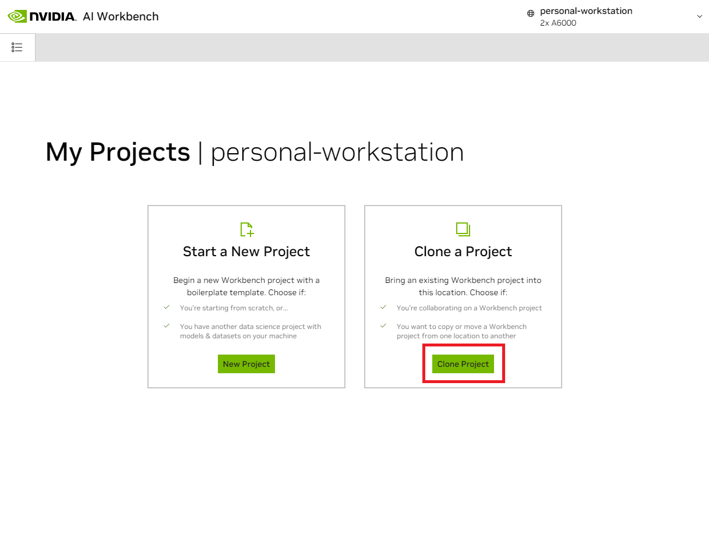
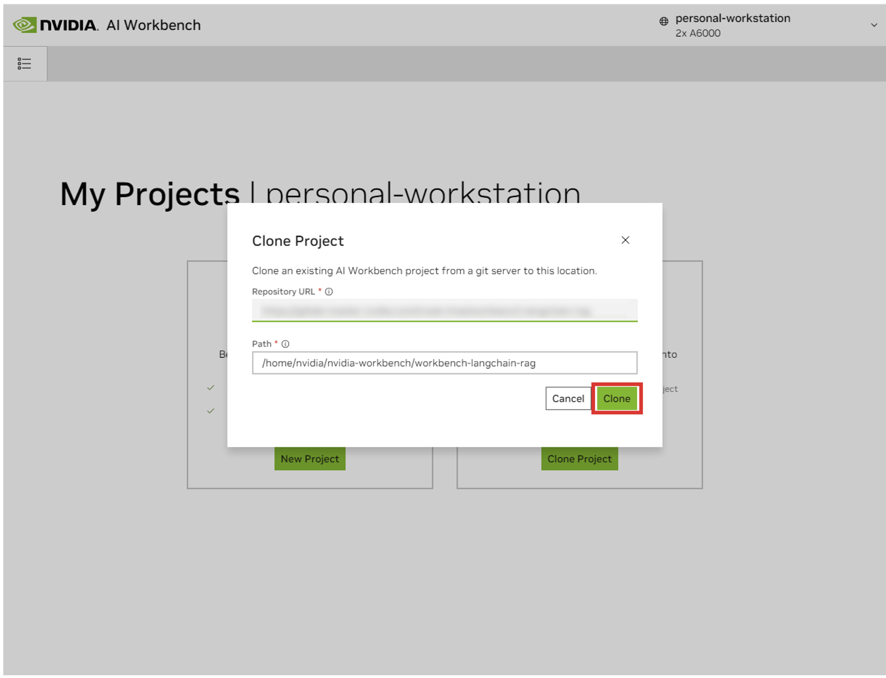
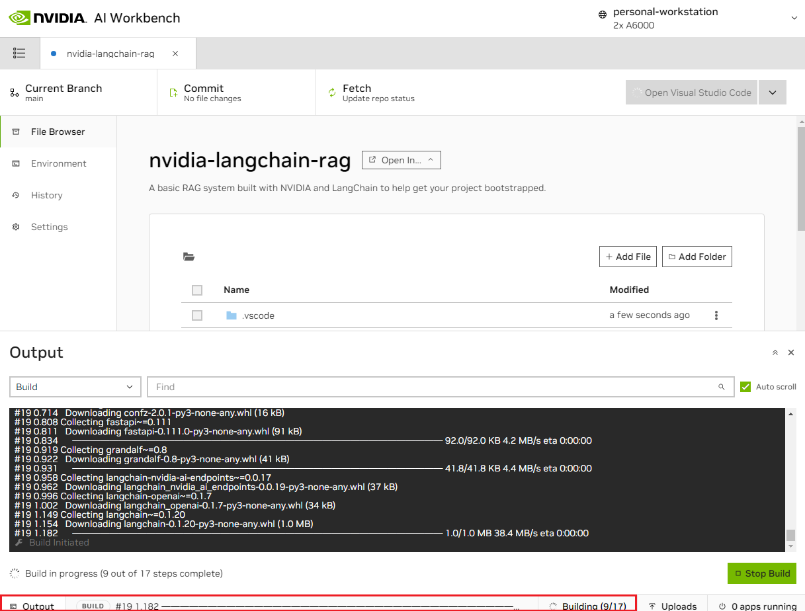

## Download this project

There are two ways to download this project for local use: Cloning and Forking.

Cloning this repository is the recomended way to start. This will not allow for local modifications, but is the fastest to get started. This also allows for the easiest way to pull updates.

Forking this repository is recomended for development as changes will be able to be saved. However, to get updates, the fork maintainer will have to regularly pull from the upstream repo. To work from a fork, follow [GitHub's instructions](https://docs.github.com/en/pull-requests/collaborating-with-pull-requests/working-with-forks/fork-a-repo) and then reference the URL to your personal fork in the rest of this section.

<details>
<summary>
<b>Expand this section for a details on downloading this project.</b>
</summary>

1. Open the local NVIDIA AI Workbench window. From the list of locations displayed, select one you would like to work in.

    

1. Once inside the location, select *Clone Project*.

    

1. Enter the URL of the project repository. You may leave the path as the default value. Press *Clone*.

    

1. You will be redirected to the new project’s page. Workbench will automatically bootstrap the development environment. You can view real-time progress by expanding the Output from the bottom of the window.

    

1. Before running for the first time, project specific configuration must be provided. Project configuration is done using the *Environment* tab from the left-hand panel.

    

1. Scroll down to the **Secrets** section and find the *NGC_API_KEY* entry. Press *Configure* and provide the personal key for NGC that was generated earlier.

1. Scroll down to the **Mounts section**. Here, there are two mounts to configure.

    a. Find the mount for /var/host-run. This is used to allow the development environment to access the host’s Docker daemon in a pattern called Docker out of Docker. Press **Configure** and provide the directory `/var/run`.

    

    b. Find the mount for /home/workbench/.cache/nvidia-nims. This mount is used as a runtime cache for NIMs where they can cache model files. Sharing this cache with the host reduces disk usage and network bandwidth.

    

    If you don't already have a nim cache, or you aren't sure, use the following commands to create one at `/home/USER/.cache/nvidia-nims`.

    ```bash
    mkdir -p ~/.cache/nvidia-nims
    chmod 2777 ~/.cache/nvidia-nims
    ```


1. Once the build completes with a *Build Ready* message, all applications will be made available to you.

</details>
