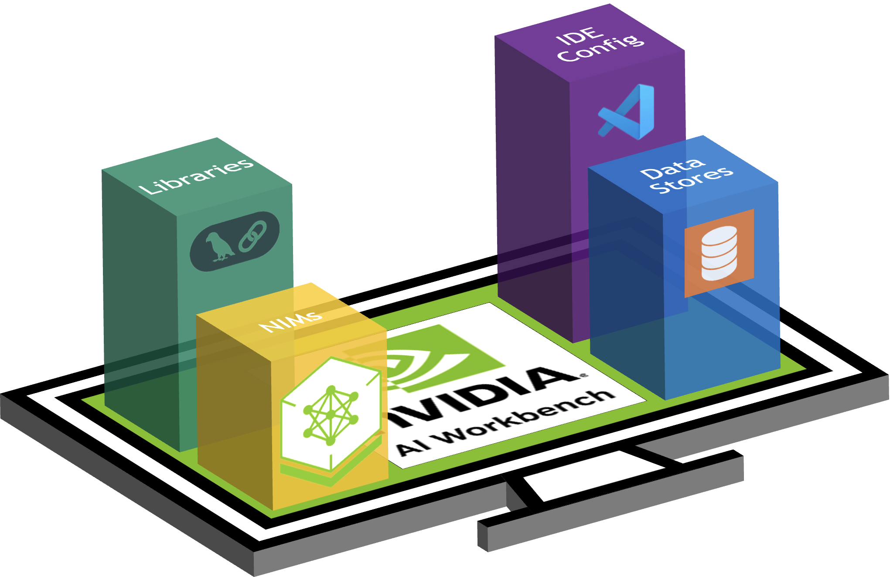

# NVIDIA Sales Kit Template

Use this project as a starting point for building new sales kits with NVIDIA AI Workbench.

| ❗ Important          |
| :---------------------------|
| When editing markdown sections, run ``make`` from this directory to populate changes to ``README.md``. If adding or removing markdown files, ensure those changes are reflected properly in the ``_TOC.md`` file. |

Get started now with the [quick start](#quick-start) instructions.

<!-- Links -->

 
  <a href="https://www.nvidia.com/en-us/deep-learning-ai/solutions/data-science/workbench/" style="color: #76B900;">⬇ Download NVIDIA AI Workbench</a> •
  <a href="https://docs.nvidia.com/ai-workbench/" style="color: #76B900;">📖 Read the Docs</a> •
  <a href="https://forums.developer.nvidia.com/c/ai-data-science/nvidia-ai-workbench/671" style="color: #76B900;">🚨 Problem? Submit a ticket here!</a>

